# FractureGraph-Control

FractureGraph-Control is a graph-based fracture-control research prototype. It builds a controlled 2D rock-reshaping benchmark around four components: a rule-based lattice fracture simulator, graph transition datasets, a MeshGraphNet-style dynamics surrogate, and model-based action planning with CEM.

The project is intentionally scoped around 2D fracture rather than full FEM. Its contribution is the end-to-end system structure: generate fracture transitions, learn graph dynamics, plan impact sequences through the learned surrogate, and evaluate whether the executed actions reshape material toward a target geometry.

| Rock Reshaping Stack | Implementation Here |
| --- | --- |
| Fracture simulator | Damage-accumulating 2D lattice simulator |
| Graph dynamics model | Edge-failure and node-alive MeshGraphNet surrogate |
| Control policy | CEM impact-sequence planner |
| Desired geometry | Binary target mask |
| Evaluation | Random, greedy, surrogate CEM, oracle CEM |

## Project Context And Fit

This repository is part of a four-project preparation set for the RSL rock
reshaping proposal. The target proposal combines fracture simulation, graph
surrogate learning, and goal-driven control. The surrounding projects are
included to show how the required stack was approached step by step rather than
as isolated demos.

| Project | What it exercises | Connection to rock reshaping |
| --- | --- | --- |
| `isaac-lab-manipulation` | Reproduces a standard Isaac Lab manipulation baseline with `rsl_rl`, evaluation scripts, and unchanged task definitions. | Establishes the robot-learning and experiment-running baseline before adding custom physics. |
| `excavation-rl` | Builds a granular excavation setting with a custom substrate and training loop. | Tests the difficulty of coupling contact-rich material simulation with RL under limited time and compute. |
| `cluttered-pick` | Returns to Isaac Lab for a bounded contact-rich manipulation diagnostic using a rigid-body granular proxy. | Keeps the material-manipulation theme while reducing simulator and infrastructure risk. |
| `fracturegraph-control` | Adds graph transition data, a MeshGraphNet-style dynamics surrogate, and target-geometry planning. | Covers the part of the proposal closest to GNN-based fracture prediction and control toward a desired shape. |

Within that preparation set, this project is a bridge between the earlier
robot-learning work and the proposed rock-reshaping stack. It does not attempt
to be a realistic FEM fracture simulator or a complete RL solution. Instead, it
keeps the interfaces that matter for the proposal: fracture transitions are
converted into graph data, a learned surrogate predicts fracture evolution, and
a planner chooses impact sequences that are evaluated against a target geometry.

The main simplifications are deliberate. FEM is replaced by a 2D lattice rule,
and the full RL agent is replaced by model-based CEM planning. This keeps the
scope small enough to train and evaluate while still making the match to the
proposal explicit: simulation data, supervised GNN dynamics learning, action
selection through the learned model, and quantitative target-shape evaluation.

## Current Deliverable Status

The current deliverable uses the balanced 24x24 setting. This scale was chosen as a practical match for the available hardware after larger 32x32 training runs proved difficult to complete reliably. The completed sweep used AWS EC2 instance type `g5.2xlarge`; the exact AMI ID was not recorded in this checkout, but the environment was a PyTorch-capable AWS Deep Learning AMI.

Headline result:

- `524mg3ns` is the selected surrogate run, with validation edge F1 `0.871` and selection score `0.9157`.
- Surrogate CEM transfers well on `triangle_wedge` and `diagonal_bevel`.
- `rectangle_cut` and `circular_notch` expose the main remaining issue: conservative planning that leaves target-removal cells alive.
- Planner-side verification found that lowering the surrogate break threshold to `0.90` helps `rectangle_cut`, but is not a stable global default because it slightly hurts `circular_notch`.
- The current planner decision is to keep the global checkpoint-threshold behavior and document `0.90` as a target-specific candidate for `rectangle_cut`.

This checkout includes the generated report artifacts:

- `results/figures/balanced_20260519/`
- `results/rollouts/balanced_monitor_20260518_213730/report.html`
- `results/rollouts/balanced_monitor_20260518_213730/eval_summary.csv`
- `results/rollouts/planner_sweep_20260519_085313/sweep_summary.csv`
- `results/rollouts/planner_verify_light_20260519_123026/sweep_summary.csv`

This checkout is a result package, not a full artifact bundle. It includes figures and rollout outputs, but not the generated balanced 24x24 dataset or selected checkpoint. For reproducibility, the selected checkpoint path used for the recorded evaluation is:

```text
results/checkpoints/balanced_monitor_20260518_213730/surrogate_best.pt
```

To rerun the exact recorded rollout, restore that checkpoint before running the `balanced_monitor_20260518_213730` command in the results section.

## Implemented System

- Config-driven simulator, dataset, model, planner, and experiment definitions.
- Lattice fracture simulator with hidden edge thresholds, anisotropic stress, damage accumulation, and fragment removal.
- Graph dataset format with node features, edge features, global action features, edge-break labels, and next-alive labels.
- MeshGraphNet-style surrogate with two prediction heads:
  - edge failure probability,
  - next-step node alive probability.
- CEM planner that can roll out either the learned surrogate or the simulator oracle.
- Multi-target, multi-seed evaluation with CSV, JSON, SVG, and HTML report outputs.
- Preset-based experiment runner for development, balanced, and scaling runs.

## Repository Layout

```text
configs/                 Data, model, training, planner, and experiment configs
scripts/                 Dataset, training, planning, evaluation, and full-run entrypoints
src/                     Simulator, graph data, model, planner, metrics, visualization
docs/aws.md              GPU training notes
docs/findings.md         Experiment notes and reporting template
results/                 Generated figures, reports, and checkpoints
data/                    Generated graph datasets
```

## Local Setup

```bash
python3 -m venv .venv
.venv/bin/python -m pip install --upgrade pip
.venv/bin/python -m pip install -r requirements.txt
```

## Reproducible 24x24 Experiment

```bash
.venv/bin/python scripts/run_full_experiment.py --preset balanced
```

This entrypoint runs:

1. dataset generation from `configs/data/lattice_24_balanced.yaml`,
2. surrogate training from `configs/train/surrogate_balanced.yaml`,
3. multi-target planning evaluation from `configs/experiment/reshape_targets_balanced.yaml`.

Main outputs:

- `data/lattice_24_balanced/`
- `results/checkpoints/balanced/surrogate_best.pt`
- `results/rollouts/balanced/eval_metrics.csv`
- `results/rollouts/balanced/eval_summary.csv`
- `results/rollouts/balanced/report.html`

This command is the from-scratch reproduction path. It generates a fresh balanced 24x24 dataset and checkpoint under `data/lattice_24_balanced/` and `results/checkpoints/balanced/`; it does not reuse the historical `balanced_monitor_20260518_213730` checkpoint unless that checkpoint is restored and passed explicitly.

W&B logging is enabled in `configs/train/surrogate_balanced.yaml`. On a fresh machine, either run `wandb login` first or set `WANDB_MODE=offline` for local/offline logging.

## Development-Scale Check

```bash
.venv/bin/python scripts/run_full_experiment.py --preset dev --max-seeds 1
```

This uses the same code path on a smaller lattice and dataset, so it is useful for checking the environment before starting the balanced 24x24 run.

## Individual Entrypoints

```bash
.venv/bin/python scripts/generate_dataset.py --config configs/data/lattice_24_balanced.yaml --render-preview
.venv/bin/python scripts/train_surrogate.py \
  --data-config configs/data/lattice_24_balanced.yaml \
  --model-config configs/model/meshgnn_balanced.yaml \
  --train-config configs/train/surrogate_balanced.yaml
.venv/bin/python scripts/eval_rollout.py \
  --experiment configs/experiment/reshape_targets_balanced.yaml \
  --checkpoint results/checkpoints/balanced/surrogate_best.pt \
  --output-dir results/rollouts/balanced
```

## Data Format

Each graph transition stores:

- `x`: node features `[x, y, boundary, alive, damage]`
- `edge_index`: lattice connectivity
- `edge_attr`: edge features `[dx, dy, length, broken]`
- `u`: global impact action `[impact_x, impact_y, force]`
- `y_edge`: newly broken edge labels
- `y_node`: next-step alive-node labels

JSONL files are written for portability. If PyTorch is installed, `.pt` copies are also written.

## Evaluation

The current 24x24 evaluation uses four target geometries:

- triangle wedge,
- diagonal bevel,
- rectangle cut,
- circular notch.

For each target and seed, it compares:

- random action sequences,
- greedy one-step planning,
- CEM on the learned surrogate,
- CEM on the simulator oracle.

The planner objective is:

```text
score = target_iou
      - action_cost_weight * average_force
      - overbreak_penalty * removed_desired_material
```

The final score is always computed after executing the chosen action sequence in the simulator.

## First Balanced 24x24 Training Run

The main completed result is the balanced 24x24 surrogate sweep finished on
2026-05-19. The goal was to improve edge-break prediction without overfitting
the node-alive head, then judge the model through rollout geometry rather than
validation metrics alone.

Validation selection used:

```text
selection_score = 0.65 * val/edge_f1 + 0.35 * val/node_iou
```

| W&B run | Recipe | Best validation | Outcome |
| --- | --- | --- | --- |
| [`ixmf3u6q`](https://wandb.ai/yangchenghan2515-eth-z-rich/fracturegraph-control/runs/ixmf3u6q) | `lr=4e-4`, `dropout=0.05` | epoch 9, edge F1 `0.868`, precision/recall `0.818/0.924`, score `0.9137` | Plateaued after the early peak. |
| [`524mg3ns`](https://wandb.ai/yangchenghan2515-eth-z-rich/fracturegraph-control/runs/524mg3ns) | `lr=2.8e-4`, `dropout=0.07` | epoch 6, edge F1 `0.871`, precision/recall `0.834/0.912`, score `0.9157` | Selected model for rollout evaluation. |
| [`r9g6ad4h`](https://wandb.ai/yangchenghan2515-eth-z-rich/fracturegraph-control/runs/r9g6ad4h) | `lr=1.96e-4`, `dropout=0.09` | epoch 8, edge F1 `0.860`, precision/recall `0.798/0.933`, score `0.9085` | Did not improve on `524mg3ns`. |
| [`bwgmxjw2`](https://wandb.ai/yangchenghan2515-eth-z-rich/fracturegraph-control/runs/bwgmxjw2) | `lr=1.372e-4`, `dropout=0.10` | epoch 6, edge F1 `0.869`, precision/recall `0.871/0.866`, score `0.9138` | Close, but still below `524mg3ns`. |
| [`4wo6hwn4`](https://wandb.ai/yangchenghan2515-eth-z-rich/fracturegraph-control/runs/4wo6hwn4) | `lr=9.604e-5`, `dropout=0.10` | stopped early | Further learning-rate descent was not worth continuing. |

If W&B access is unavailable, exported local histories are stored in
`results/figures/balanced_20260519/wandb_histories.json`.

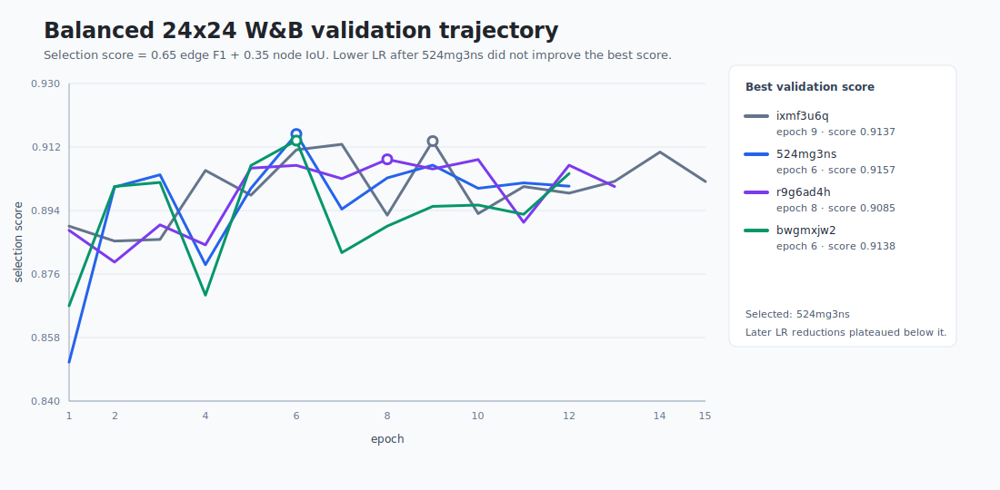

The selected checkpoint used for rollout evaluation is:

```text
results/checkpoints/balanced_monitor_20260518_213730/surrogate_best.pt
```

Rollout evaluation was run with:

```bash
.venv/bin/python scripts/eval_rollout.py \
  --experiment configs/experiment/reshape_targets_balanced.yaml \
  --checkpoint results/checkpoints/balanced_monitor_20260518_213730/surrogate_best.pt \
  --output-dir results/rollouts/balanced_monitor_20260518_213730
```

Key rollout outputs:

- `results/rollouts/balanced_monitor_20260518_213730/report.html`
- `results/rollouts/balanced_monitor_20260518_213730/eval_summary.csv`
- `results/rollouts/balanced_monitor_20260518_213730/*.svg`

Surrogate CEM rollout summary:

| Target | `cem_surrogate` mean final IoU | Best competing baseline | Readout |
| --- | ---: | ---: | --- |
| `triangle_wedge` | `0.9773` | greedy `0.9817` | Good; close to oracle and greedy. |
| `diagonal_bevel` | `0.9869` | greedy `0.9895` | Good; visually and numerically strong. |
| `rectangle_cut` | `0.9539` | greedy `0.9761` | Weaker; tends to leave target material uncut. |
| `circular_notch` | `0.9430` | greedy `0.9681` | Weaker; curved boundary is not cut cleanly enough. |

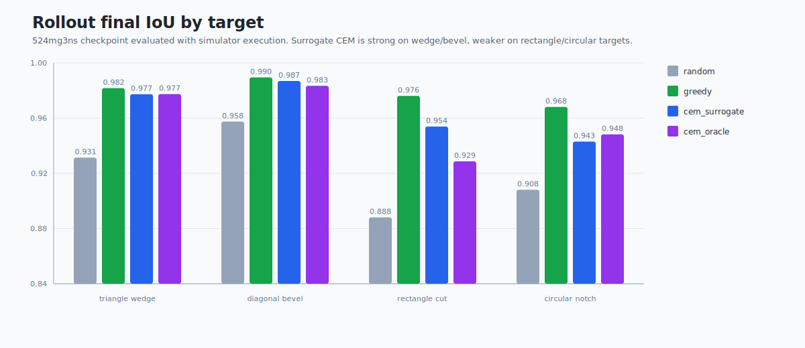

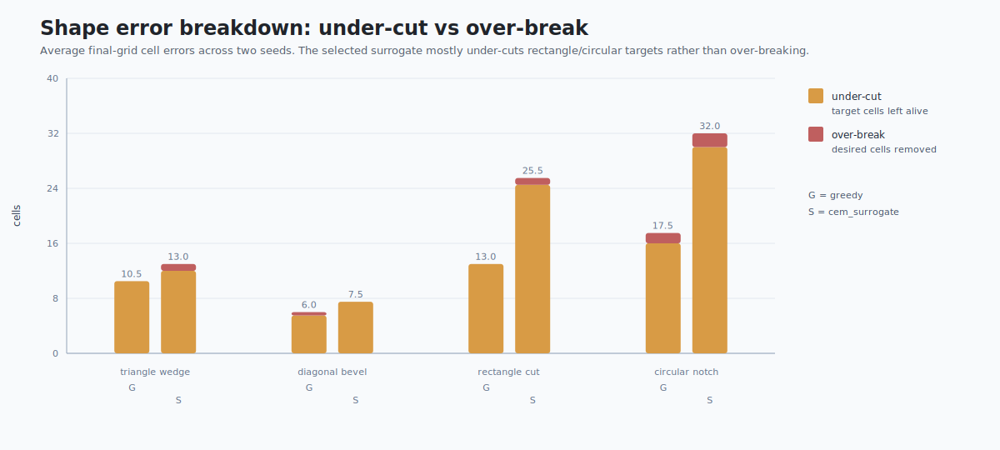

The visual diagnosis is that `524mg3ns` is not mainly over-breaking. It is
slightly conservative during planning: for the harder rectangle and circular
targets, the final state leaves more target-removal cells alive than greedy.
This matches the validation profile: edge recall is useful, but the planner is
not aggressive enough on some geometries.

Representative strong surrogate rollouts:

| `triangle_wedge.seed_1.cem_surrogate` | `diagonal_bevel.seed_1.cem_surrogate` |
| --- | --- |
| 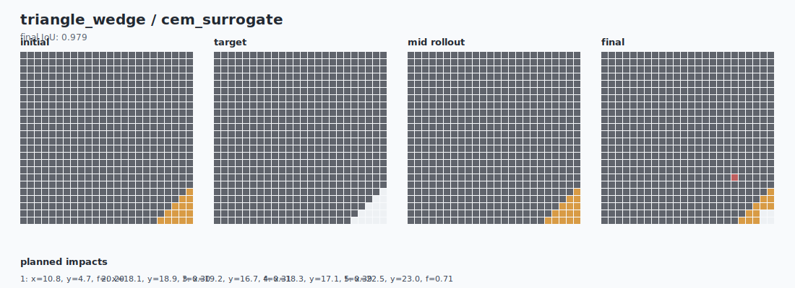 | 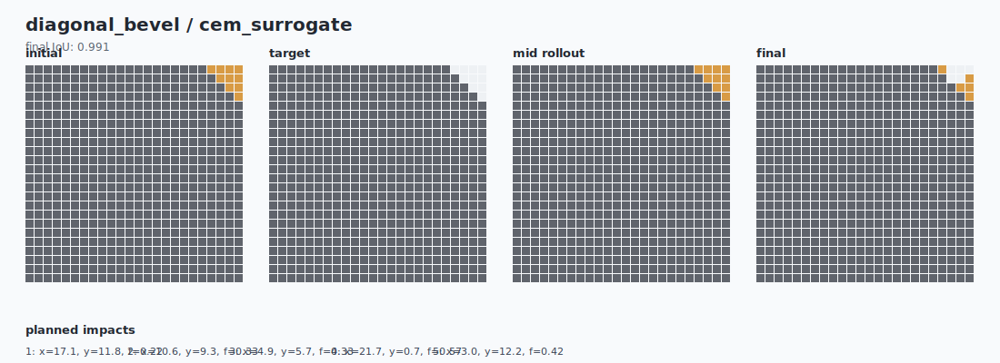 |

Representative failure cases, comparing greedy with surrogate CEM:

| `rectangle_cut.seed_1.greedy` | `rectangle_cut.seed_1.cem_surrogate` |
| --- | --- |
| 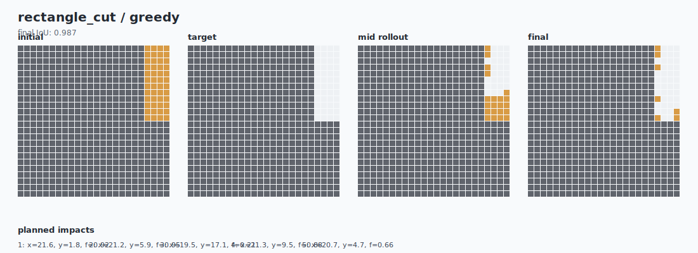 | 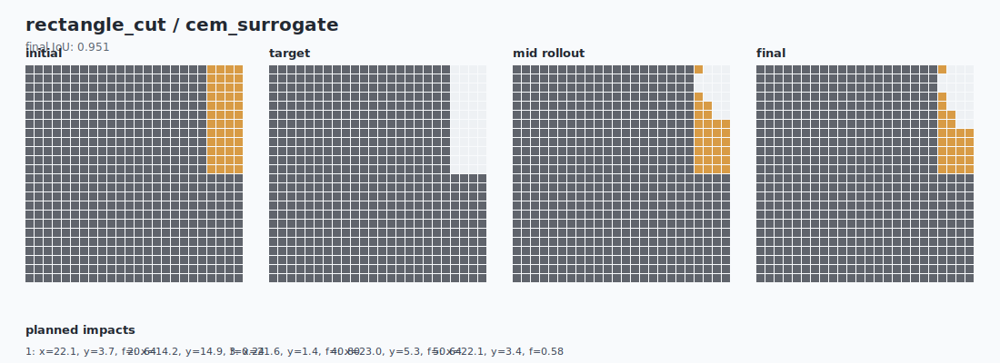 |

| `circular_notch.seed_1.greedy` | `circular_notch.seed_1.cem_surrogate` |
| --- | --- |
| 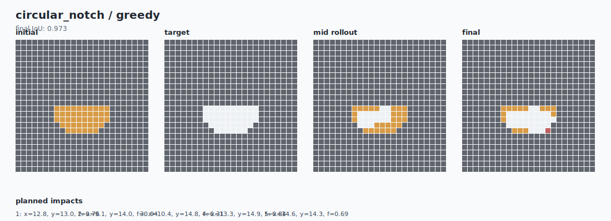 | 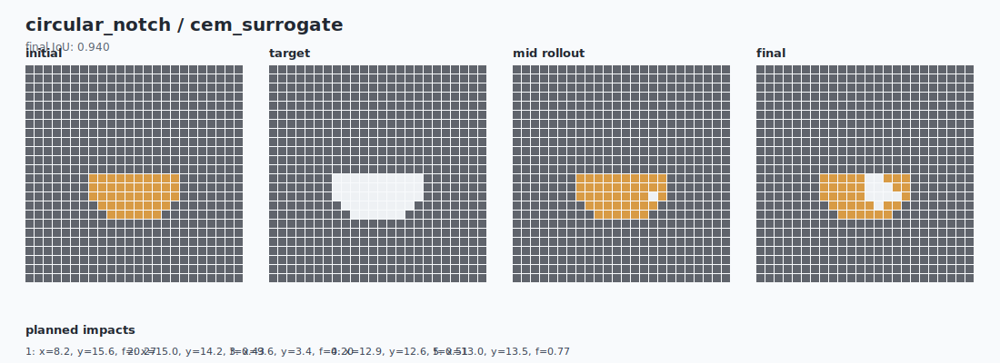 |

## Planner Threshold Sweep

After selecting `524mg3ns`, a focused planner-side sweep was run on
2026-05-19. This was not another surrogate-training run; it reused the fixed
checkpoint and logged rollout metrics to W&B:

[`s84mc1x3`](https://wandb.ai/yangchenghan2515-eth-z-rich/fracturegraph-control/runs/s84mc1x3)

The run focused on the two weak targets, `rectangle_cut` and `circular_notch`,
and compared surrogate CEM variants around edge-break thresholds `0.85`,
`0.90`, and `0.95`, plus larger CEM budget, lower action cost, lower
overbreak penalty, and horizon 6 variants.

```bash
.venv/bin/python scripts/sweep_planner_rollouts.py \
  --suite full \
  --targets rectangle_cut,circular_notch \
  --checkpoint results/checkpoints/balanced_monitor_20260518_213730/surrogate_best.pt \
  --output-root results/rollouts/planner_sweep_20260519_085313 \
  --device auto \
  --wandb \
  --wandb-project fracturegraph-control \
  --wandb-run-name planner-sweep-524mg3ns-20260519_085313
```

Primary output:

```text
results/rollouts/planner_sweep_20260519_085313/sweep_summary.csv
```

Important comparison caveat: this focused sweep logged `cem_surrogate` only and
uses a different method ordering from the full baseline evaluation. Compare
variants within this sweep directly; compare against the earlier full rollout
numbers directionally.

| Variant | Planner change | `circular_notch` IoU / undercut / overbreak | `rectangle_cut` IoU / undercut / overbreak | Readout |
| --- | --- | ---: | ---: | --- |
| `checkpoint_threshold` | checkpoint threshold, horizon 5 | `0.9491 / 0.6478 / 0.0000` | `0.9344 / 0.7500 / 0.0019` | Sweep baseline. |
| `break_th_085` | threshold `0.85` | `0.9375 / 0.8068 / 0.0000` | `0.9336 / 0.7604 / 0.0019` | Worse; lower threshold did not help. |
| `break_th_090` | threshold `0.90` | `0.9526 / 0.5909 / 0.0009` | `0.9378 / 0.7188 / 0.0009` | Best initial default candidate before verification. |
| `break_th_095` | threshold `0.95` | `0.9491 / 0.6478 / 0.0000` | `0.9344 / 0.7500 / 0.0019` | Same behavior as checkpoint in this sweep. |
| `break_th_090_budget` | threshold `0.90`, population `384`, iterations `6` | `0.9415 / 0.7159 / 0.0028` | `0.9395 / 0.6979 / 0.0009` | Helps rectangle modestly, hurts circular. |
| `break_th_090_lighter_cost` | threshold `0.90`, action cost `0.015` | `0.9431 / 0.6819 / 0.0037` | `0.9404 / 0.6979 / 0.0000` | Best horizon-5 rectangle candidate. |
| `break_th_090_lighter_overbreak` | threshold `0.90`, action cost `0.015`, overbreak `0.4` | `0.9499 / 0.6022 / 0.0028` | `0.9377 / 0.6979 / 0.0029` | Balanced but not best. |
| `break_th_090_h6_budget` | threshold `0.90`, horizon `6`, population `384`, iterations `6` | `0.9358 / 0.8181 / 0.0009` | `0.9418 / 0.6250 / 0.0047` | Best rectangle undercut reduction, but bad for circular. |

Representative sweep visualizations:

| `circular_notch.seed_1` checkpoint threshold | `circular_notch.seed_1` threshold `0.90` |
| --- | --- |
| IoU `0.9483`, undercut `0.6591`, overbreak `0.0000` | IoU `0.9602`, undercut `0.4773`, overbreak `0.0019` |
| 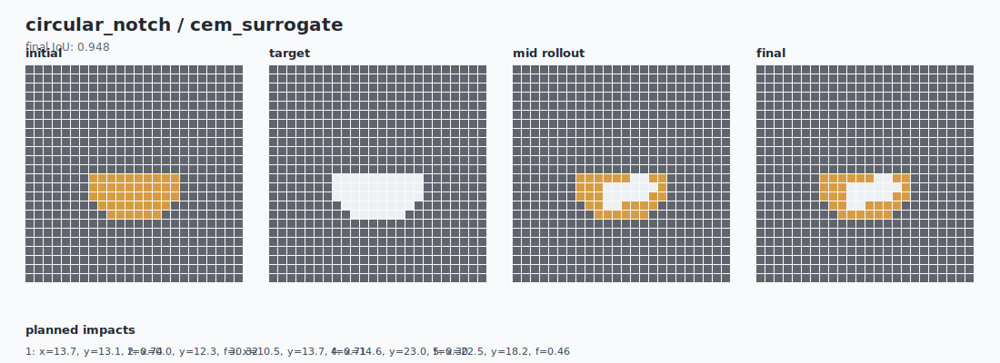 | 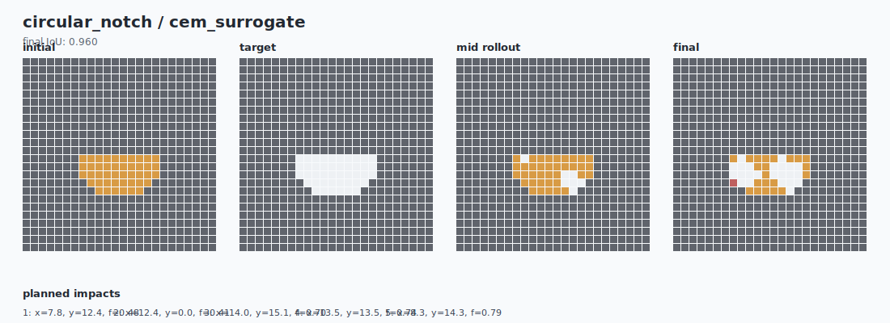 |

| `rectangle_cut.seed_1` checkpoint threshold | `rectangle_cut.seed_1` threshold `0.90`, horizon 6, larger budget |
| --- | --- |
| IoU `0.9312`, undercut `0.8125`, overbreak `0.0000` | IoU `0.9441`, undercut `0.5625`, overbreak `0.0076` |
| 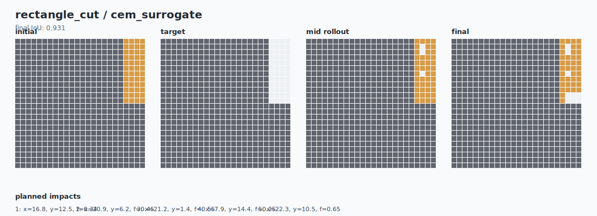 | 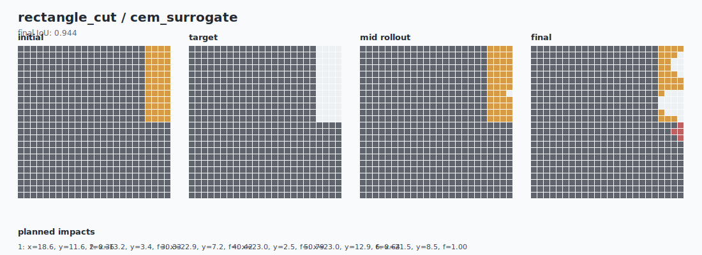 |

The initial sweep supported two working hypotheses:

1. Keep `524mg3ns` as the current best surrogate; do not continue lowering the
   learning rate.
2. Test threshold `0.90` as a planner-side candidate and verify whether horizon
   6 with larger CEM budget should be target-specific for `rectangle_cut`.

That verification is recorded in the next section. The verification changed the
decision: threshold `0.90` is useful for `rectangle_cut`, but should not become
a global default.

## Planner Verification

A lighter verification run was executed after the broad sweep to avoid
over-interpreting a two-seed result. This run reused `524mg3ns`, focused on the
two hard targets, and compared only surrogate CEM variants across seeds
`[0, 1, 2, 3]`.

W&B run:

[`tfabg4xp`](https://wandb.ai/yangchenghan2515-eth-z-rich/fracturegraph-control/runs/tfabg4xp)

```bash
.venv/bin/python scripts/sweep_planner_rollouts.py \
  --suite verify \
  --targets rectangle_cut,circular_notch \
  --max-seeds 4 \
  --compare cem_surrogate \
  --checkpoint results/checkpoints/balanced_monitor_20260518_213730/surrogate_best.pt \
  --output-root results/rollouts/planner_verify_light_20260519_123026 \
  --device auto \
  --wandb \
  --wandb-project fracturegraph-control \
  --wandb-run-name planner-verify-light-524mg3ns-20260519_123026
```

Primary outputs:

- `results/rollouts/planner_verify_light_20260519_123026/sweep_summary.csv`
- `results/rollouts/planner_verify_light_20260519_123026/checkpoint_threshold/report.html`
- `results/rollouts/planner_verify_light_20260519_123026/break_th_090/report.html`
- `results/rollouts/planner_verify_light_20260519_123026/break_th_090_h6_budget/report.html`

Verification summary:

| Variant | Planner change | `circular_notch` IoU / undercut / overbreak | `rectangle_cut` IoU / undercut / overbreak | Readout |
| --- | --- | ---: | ---: | --- |
| `checkpoint_threshold` | checkpoint threshold, horizon 5 | `0.9473 / 0.6307 / 0.0033` | `0.9365 / 0.7344 / 0.0009` | Best circular mean; rectangle remains under-cut. |
| `break_th_090` | threshold `0.90`, horizon 5 | `0.9457 / 0.6648 / 0.0024` | `0.9415 / 0.6614 / 0.0019` | Best rectangle mean; circular mean slips slightly. |
| `break_th_090_h6_budget` | threshold `0.90`, horizon 6, population `384`, iterations `6` | `0.9387 / 0.7841 / 0.0005` | `0.9393 / 0.6562 / 0.0047` | Not worth adopting: worse circular and more rectangle overbreak. |

Visual verification: `rectangle_cut` benefits from threshold `0.90` on some
seeds. In seed 3, the lowered threshold cuts more of the intended rectangular
notch with only a small overbreak increase.

| `rectangle_cut.seed_3` checkpoint threshold | `rectangle_cut.seed_3` threshold `0.90` |
| --- | --- |
| IoU `0.9378`, undercut `0.7292`, overbreak `0.0000` | IoU `0.9495`, undercut `0.5625`, overbreak `0.0019` |
| 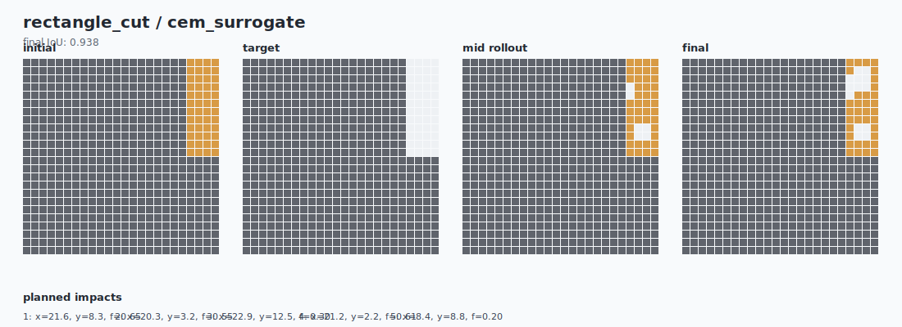 | 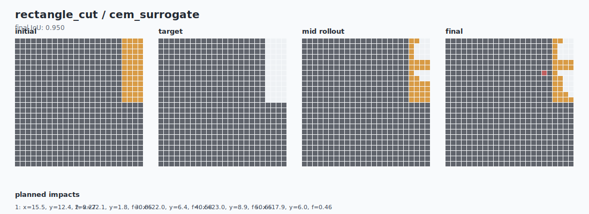 |

Visual verification: `circular_notch` is less stable under threshold `0.90`.
Seed 2 shows the lowered threshold producing a worse circular cut and a small
amount of overbreak, which explains why the four-seed mean favors the checkpoint
threshold for this target.

| `circular_notch.seed_2` checkpoint threshold | `circular_notch.seed_2` threshold `0.90` |
| --- | --- |
| IoU `0.9449`, undercut `0.7045`, overbreak `0.0000` | IoU `0.9362`, undercut `0.7273`, overbreak `0.0075` |
| 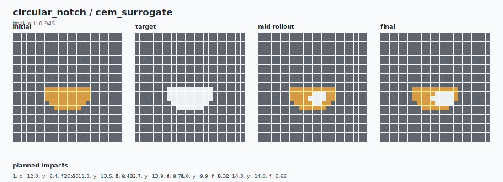 | 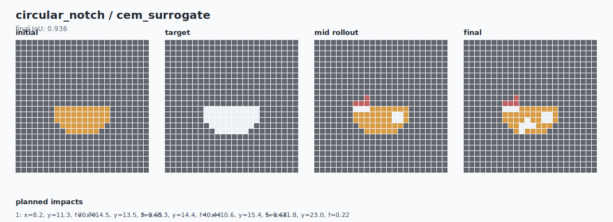 |

Visual verification: horizon 6 with larger CEM budget is too aggressive for
`circular_notch`. It reduces force in this run, but leaves substantially more
notch material uncut.

| `circular_notch.seed_0` checkpoint threshold | `circular_notch.seed_0` threshold `0.90`, horizon 6 |
| --- | --- |
| IoU `0.9500`, undercut `0.6364`, overbreak `0.0000` | IoU `0.9268`, undercut `0.9545`, overbreak `0.0000` |
| 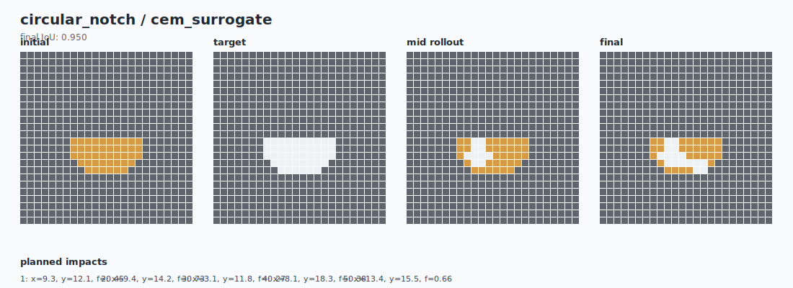 | 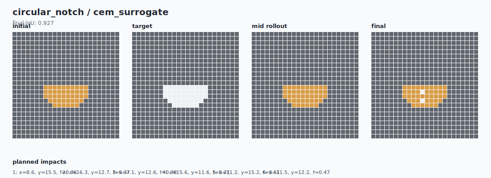 |

Final planner-side decision after verification:

- Keep `524mg3ns` as the selected surrogate.
- Do not lower the break threshold globally.
- Use checkpoint threshold behavior for `circular_notch`.
- Document threshold `0.90` as the best current target-specific candidate for `rectangle_cut`.
- Do not adopt horizon 6 with larger CEM budget as a default; it lowers
  rectangle undercut slightly but loses IoU and damages circular notch behavior.

The current deliverable keeps the global planner behavior and documents the
rectangle limitation. A future stronger version can add explicit target-specific
planner overrides for `rectangle_cut`.

## Larger Lattices

The repository still contains 32x32 and 48x48 configs for scaling experiments, but they are not the current deliverable baseline. Treat them as future work for a stronger GPU environment. See [docs/aws.md](docs/aws.md) for cloud setup notes if moving beyond the balanced 24x24 run.
